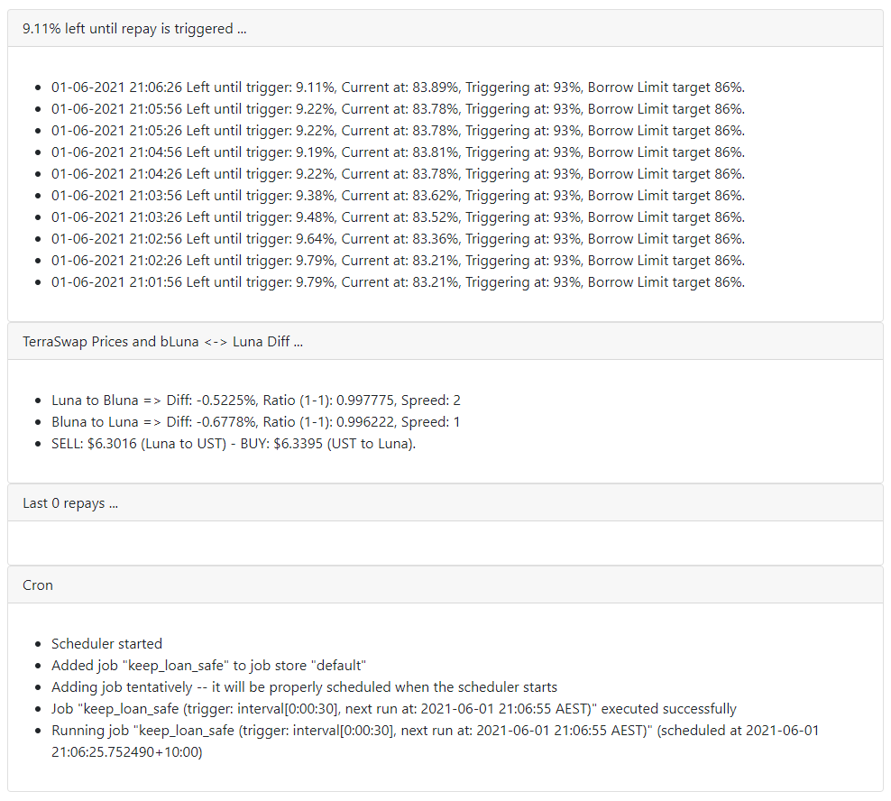

## Support!
- If you feel this project is the right one for you, please, donate to `terra1uwkfuh6crvlttqsj2rv0tjpl8v0dy3d4swayg7` if you feel like doing so.

Thanks Terra and Anchor team!

Cheers all!

## Why
My day job requires a fairly good amount of automation from time to time. Besides, I do like computers to work on what I cannot while I'm sleeping!

`AnchorHoDL` is an implementation that *auto-pay/auto-borrow* based on whatever config you desire.

I've started this app due my own needs and to learn more about Terra's ecosystem.

## How it works
1. It will query Anchor smart contracts checking LTV (Loan-to-Value);
2. If the LTV is grater than `trigger_at_percent` it will trigger a repay action.
3. If the amount required to repay (`target_percent`) is in the wallet, it will be used and loan will repay back to `target_percent` mark.
4. If not, it will withdraw from `aUST` (Anchor deposit).
5. The script **will NOT** sell any asset to pay loan.
6. If `enabled_auto_borrow` is enabled (by default) and current LTV is smaller than `auto_borrow_at_percent`, an  auto borrow will be trigger moving LTV to `target_percent`.

## How to use it
1. `git clone` this repository.
2. Rename `config.py.sample` to  `config.py`.
3. Change `config.py` as you desire and feed your seed *(a dedicated wallet is recommended)*.
4. Run  `pip3  install -r requirements.txt`
5. Run `python3 webview.py` and simply browsing to http://localhost:5000 for  an auto-pay/borrow running every 30 seconds. 
**OR** Run `python3 hold.py`
   
## Persistence mode
1. Install gunicorn: `pip3 install gunicorn`
2. Run `gunicorn -b 127.0.0.1:5000 webview:app --daemon`

Done! gunicorn is running as daemon! 

## Docker mode
1. If you don't have Docker installed, grab if from <https://docs.docker.com/get-docker/>.
2. Once installed, clone this repository by `git clone https://github.com/unl1k3ly/AnchorHODL`
3. Rename `config.py.sample` to `config.py` and provide details.
4. Build the image with `docker build -t AnchorHODL . ` 
5. Run the image with `docker run -p 5000:5000 AnchorHODL:latest` or add `-d` if you want to run it as a daemon.
6. Check if its working by `http://localhost:5000`

## Screenshots 

- Or (recommended) you can spin a web service that does everything for you after you ran `python3 webview.py`

  
## Slack Notification 
If you use more Slack on daily bases like me, it might be simpler to be notified in there using Slack Webhooks.
1. Create a Slack APP.
2. Add the APP to a channel and get a webhook URL to feed the `config.py`.

More information can be found via this link https://api.slack.com/incoming-webhooks
## Telegram Notification
If you want to be notified via Telegram, you'd need to get `access_token` and your `chat_id` from your Telegram bot.
If you are not familiarized creating a Telegram bot, please follow steps below:
1. On Telegram, find `@BotFather` and open a DM.
2. Use `/newbot` to create a new bot for yourself.
3. Then, name the bot as you wish, ie: `MyCoolBot`
4. Now, choose whatever username you desire for your bot, ie: `MyCool_bot` 
5. Done! You should see a "Congratulations" message from BotFather.
6. To get your own `chat_id`, simply open a DM with your bot, send something up and run the following command below: `curl -s  https://api.telegram.org/ACCESSTOKEN/getUpdates` (replace `ACCESSTOKEN` with an actual token you just got from item #5).
7. With  `access_token` and `chat_id` just feed the `config.py` file.

If  these instructions are unclear, just Google "How to create a Telegram Bot and get your own chat_id"!

##  Considerations  
- It's recommended to run this code in a contained environment at maximum security. Dockerfile is also provided if you want to deploy it seamless somewhere.
- If you are using the `webview`, ensure the access is restricted and not exposed to the entire Internet. You can use "CloudFare Argo Tunnel" for that.
- Since a wallet seed is required, ensure you protect it and know what you're doing while using this automation ...
- If you don't want to pass secrets into the config.py file, make sure you declare as a system variable.
- **Everything** will be logged into the `./logs` folder. Make sure you check those from time to time!

## Conclusion 
- I have no intentions to actively develop new features or take issue requests. As mentioned, this automation was to address a self issue I had and consequently avoid liquidation! It works for my own needs.
- I'm happy to fix bugs or take merge requests.
- If you intend to modify the code yourself, please do a fork and start from it !

## Similar projects
- https://github.com/ALPAC-4/auto_repay
- https://github.com/RomainLanz/anchor-borrow-bot

